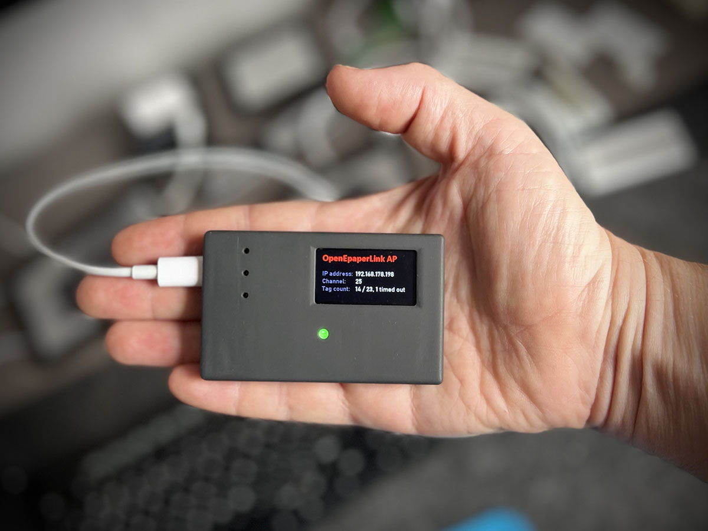
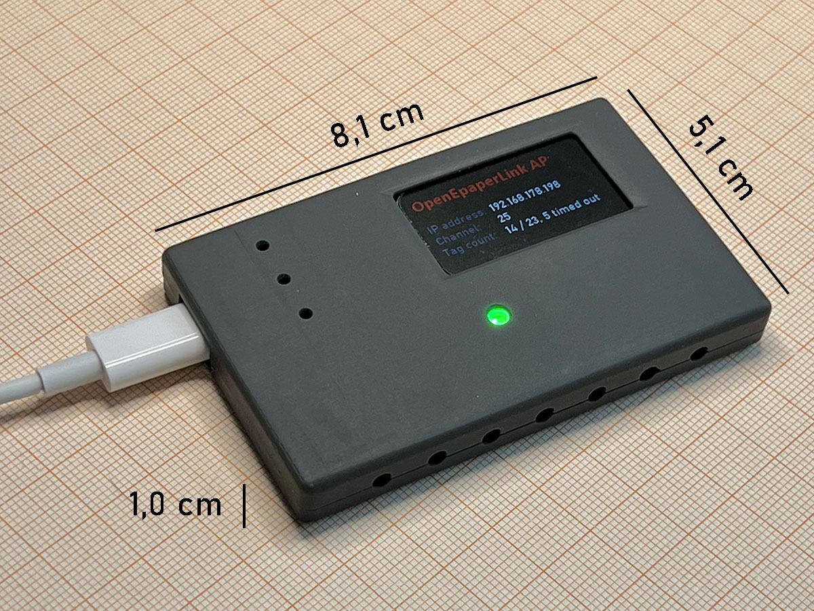
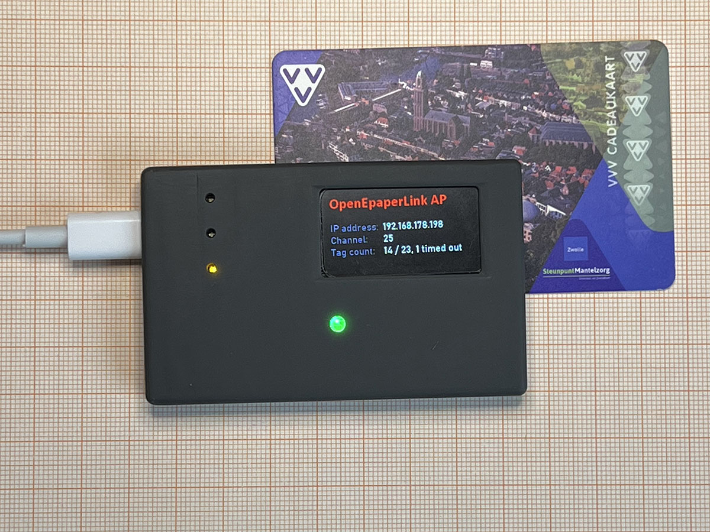

# Mini-AP-v3

 

Universal ESP32-C6 and ESP32-S3 based device, usable as WiFi <-> IEEE 802.15.4 gateway or as OpenEpaperlink Access Point
You can [buy it as a kit or fully assembled on Tindie](https://www.tindie.com/products/electronics-by-nic/openepaperlink-mini-ap-v3-zigbee-wifi-gateway/)

## What the heck can I do with this?

Basicly, this is a universal WiFi <-> IEEE 802.15.4 gateway, with a size smaller than a credit card.

You can use this set to setup your own E-Paper display system at home. The displays can display nearly anything. Just send a jpg file to the AP, and it can be displayed on one of the displays. The AP can generate all kinds of content itself too! Stuff like weather forecasts and the date can be shown on a tag, making for a nice dynamic little screen. It's also possible to use the OpenEpaperLink AP with HomeAssistant thanks to an integration.

All details can be found here: [OpenEPaperLink](https://github.com/jjwbruijn/OpenEPaperLink/wiki).
With this Access Point and some displays, you have a fully working system.

If you just want to tinker with Zigbee instead, you can make this as a WiFi to Zigbee gateway, possibly use it together with Zigbee2mqtt. But no software is written for it yet, if you want to use it that way. Looking forward to see some nice implementations!

### Background info

The AP is based on an ESP32-S3 and uses a ESP32-C6 as a radio interface. With the OpenEpaperLink software, the system uses unencrypted, Zigbee-like (IEEE 802.15.4) packets on 2.4Ghz. Thanks to a web-interface on the ESP32-S3, the accesspoint is fully self-contained to works together with electronic shelf labels that run the OpenEpaperLink firmware.

## What you will receive

On my [Tindie shop](https://www.tindie.com/products/electronics-by-nic/openepaperlink-mini-ap-v3-zigbee-wifi-gateway/) you will find multiple options:

#### **Kit:**

- 3D-printed case (SLA, professionally resin printed)
- PCB, with SMD-components already mounted
- ESP32-S3-WROOM-1 module (16 MB flash, 8 MB psram)
- ESP32-C6-WROOM-1 module (4 MB flash)
- 1.47" TFT screen
- WS2812B LED and 3x 0603 SMD Led.

To build it, you need to mount the ESP32-S3 and -C6 module, the TFT, and the leds. You need some soldering experience to do this. You can solder them by hand, but you need a good soldering iron with a very fine tip and steady hands. The 0603 components are really tiny. If you're not sure if you're able to handle the tiny parts in the kit, it's better to order this assembled version. After building, You'll need to program the ESP32-S3 and the ESP32-C6 using the [OpenEPaperLink Web Flasher](https://openepaperlink.de/) or PlatformIO.
The Access Point is powered by USB-C cable (not included)

#### **Assembled:**

As above, but completely assembled, programmed, and fully tested Mini-AP v3. No soldering needed. Connect a USB-C cable (not included), enter your wifi details, and it's running. By the way, it's fully self-contained and doesn't use any cloud based service to work.

#### **Optional price tags:**

The pricetags are recycled Solum electronic shelf labels that were used in stores, and run on a custom firmware called OpenEPaperLink. The pricetags themselves run on a undocumented SOC, the ZBS243. 
There are 2.9" and/or 1.54" tags. They have 296x128 / 152x152 pixels, Black-White-Red.

If you want to get the tags, order them here: [2.9" tags](https://www.tindie.com/products/electronics-by-nic/5-pcs-29-epaper-tags-for-openepaperlink/), [1.54" tags](https://www.tindie.com/products/electronics-by-nic/5-pcs-154-epaper-tags-for-openepaperlink/). They are preprogrammed with the OpenEPaperLink firmware. The tags include batteries (only when ordered for shipping inside the EU), but as they are not new, I cannot estimate the life span of them. They take CR2450 batteries, which can be found online. The 2.9" tags take two of them.

 

## Things you should know:

This is hobby-DIY-maker stuff, made by a hobbyist. Please don't use this where its functioning or malfunctioning may cause, or lead to, directly or indirectly, damage to property, damage to life or limb, or psychological distress. I'm no lawyer, but I basically don't want to get sued over providing people with some nice toys to tinker with.

The OpenEPaperLink software is open-source. Contributions to the project are very welcome!
I invest a significant amount of time in software development for the OpenEpaperLink project. The software is free, but when you [purchase this hardware](https://www.tindie.com/products/electronics-by-nic), you directly contribute to making this possible. Thank you for your support!

 
