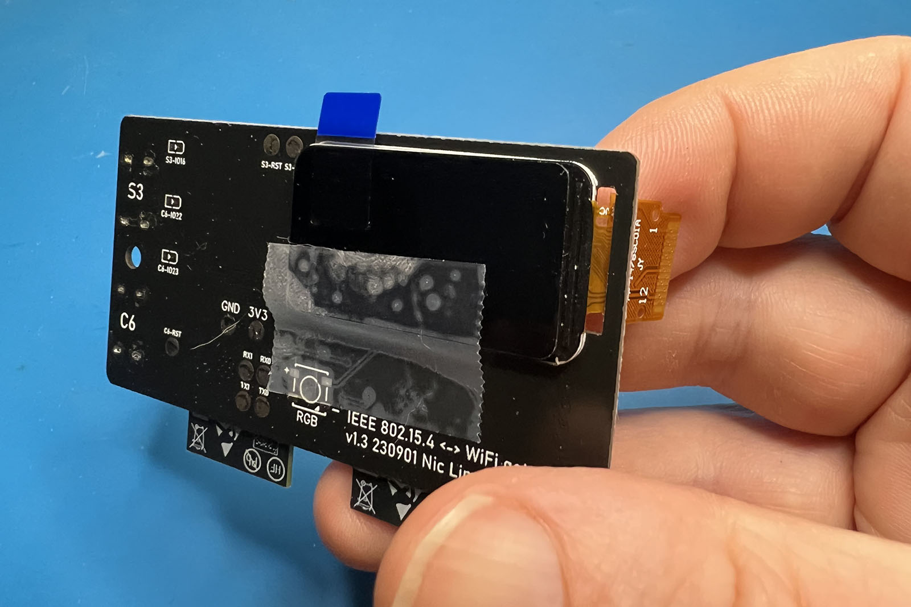

# Building instructions

If you get the kit, you will receive:

- 3D-printed case (SLA, professionally resin printed)
- PCB, with SMD-components already mounted
- ESP32-S3-WROOM-1 module (16 MB flash, 8 MB psram)
- ESP32-C6-WROOM-1 module (4 MB flash)
- 1.47" TFT screen
- WS2812B LED and 3x 0603 SMD Led.

To build it, you need to mount the ESP32-S3 and -C6 module, the TFT, and the leds. You need some soldering experience to do this. You can solder them by hand, but you need a good soldering iron with a very fine tip and steady hands. The 0603 components are really tiny. If you're not sure if you're able to handle the tiny parts in the kit, it's better to order this assembled version. After building, You'll need to program the ESP32-S3 and the ESP32-C6 using the [OpenEPaperLink Web Flasher](https://openepaperlink.de/) or PlatformIO.
The Access Point is powered by USB-C cable (not included)

## Detailed instructions

1. 
In this description, we assume you will use a soldering iron with a very fine (and clean) tip, and thin (0.5mm or 0.8mm) solder wire with rosin core. Have your fine tweezers ready. It helps very much if you have extra flux, soldering wig and a loupe. Make sure you have all components. Don't take the leds out of the plastic strips yet, because you very likely will lose them.
If instead you own a hotplate or even a reflow oven, you know what to do, instead of using the soldering iron. Although you probably still use the soldering iron to mount the TFT.

2. 
We start with mounting the ESP32-S3. That's the little board with castelated holes on three sides. Align carefully on the pcb, make sure all three sides align perfectly. Tag one pin, and check alignment again. Then, solder all other pins. Using extra flux can help. Do a visual inspection to see if all castelated holes are connected with the pcb, and correct if necessary. On the photo below, you will see that the second pin from the left is not soldered right. If you create a soldering bridge, use soldering wig to remove the solder.

3.
Before we continu, we test if the ESP32-S3 is mounted right. Connect a usb-c cable to the USB S3 port and to your computer. You can either use PlatformIO or https://install.openepaperlink.de to flash the OpenEpaperLink software on it (make sure you choose the environment 'ESP32_S3_16_8_YELLOW_AP'), or just start a serial terminal (115200 baud 8N1) to see if you ESP32-S3 gives a boot message when you press the S3_RST button on the pcb. See the [/getting_started](/getting_started) section for instructions for flashing.

4.
Continue by placing the ESP32-C6. Same produre as the ESP32-S3. Don't forget a good visual inspection.

5.
Time to place the TFT. From the front-side of the pcb, stick the ribbon cable through the slot. Align the TFT perfectly on the outline on the silkscreen of the pcb, and stick it in place with a piece of tape.
At the back of the board, fold the ribbon cable to the contacts. Align them well, and apply flux. With a bit of solder, swipe the soldering iron over the contacts to join them together. See https://www.youtube.com/watch?v=Y1cKtGnw5dE . When two pins are shorted, it will solve itself by adding flux or using soldering wig. But note: if it looks like you're getting a short between pins 3 and 4, or pins 5 and 6, don't fear, that's by design, as they are connected together.

6. 
If you flashed the OpenEpaperLink software on the S3 in step 3, you can connect the board to usb power, and check if the display is working. Check! Carefully remove the tape you used to hold the tft in place.

7.
On to the front side. Start with the neopixel. Apply solder to one of the pads. Hold the neopixel in place (pay good attention: there's a little triangle on the pcb footprint. The little diagonal corner at the neopixel should align with that). Tag one pad in place. If the alignment is still right, solder the other pads. 

8. 
Almost there, but the hardest part comes now: solder the three 0603 led's. First, apply some solder to one pad of each led footprint. Take three leds out of the package without losing them. Place them on the pcb with your tweezers, and align them the right way. There's a little black dot on the front of the led, just off center. It should be at the right side. See photo: led 1 and 3 are orientated right, the middle led is orientated wrongly. 

9.
Final steps: use thin double sided tape to carefully stick the tft in place. Place the pcb on the top part of the case, and close it using the bottom part.

## Software

If you did't flash the ESP32-S3 software at point 3, do it now. 
The display should show it started a Wifi access point 'OpenEpaperLink'. Connect to it and visit http://192.168.4.1 . The ESP32-C6 doesn't have any software yet, so on the webpage it shows 'failed'. Go to APconfig, WiFi config, and enter the credentials of the WiFi connection. Save Wifi settings and reboot.

to be continued...
